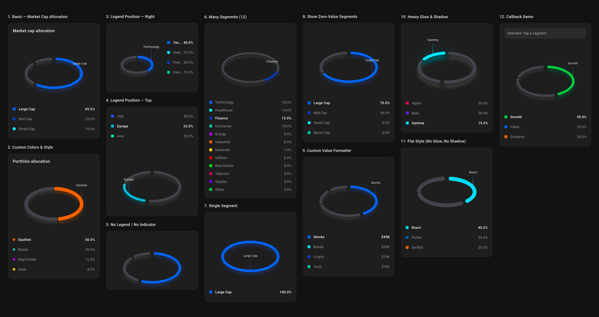
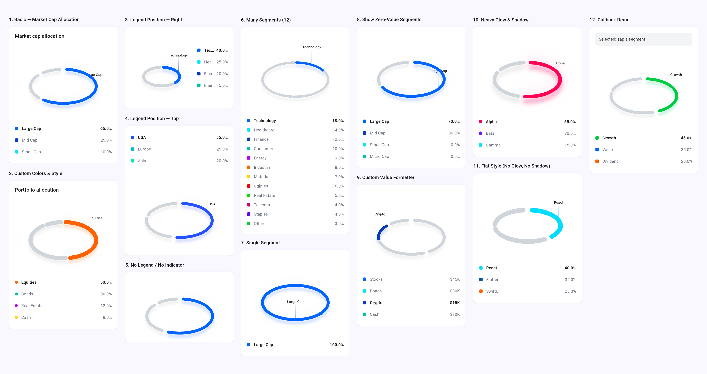

# three_d_pie_chart

A production-grade, fully customizable **3D tilted elliptical ring chart** for Flutter. Built with `CustomPainter` for pixel-perfect rendering, smooth animations, and zero dependencies beyond Flutter itself.

[](https://pub.dev/packages/three_d_pie_chart)
[](LICENSE)
[](https://flutter.dev)
[](https://dart.dev)


## Screenshots

| Dark Mode |
|:-:|
|  |

| Light Mode |
|:-:|
|  |


---

## Why three_d_pie_chart?

Most chart libraries give you flat, 2D pie charts with limited styling. This package renders a **perspective-tilted elliptical ring** — the kind of premium chart you see in fintech apps, portfolio trackers, and investor dashboards — with every visual detail under your control.

**What makes it different:**

- **True 3D depth** — Shadow layer beneath the ring creates a realistic perspective tilt, not just a squished circle.
- **Glow on selection** — The selected segment gets a soft luminous halo (two concentric blur layers), giving it a polished, modern feel.
- **Gradient indicator line** — A vertical line rises from the selected segment with a fade-to-transparent gradient and a floating label.
- **30+ style parameters** — Stroke width, gap angle, tilt factor, shadow offset/blur/opacity, glow spread/blur, indicator height, legend position, text styles, animation curve... if you can see it, you can change it.
- **Zero external dependencies** — Pure Flutter. No heavy charting frameworks. Just `CustomPainter` and math.

---

## Features

| Feature | Description |
|:---|:---|
| **3D Perspective Ring** | Tilted elliptical ring with configurable tilt factor (`0.0` to `1.0`), shadow depth, and glow effects |
| **Full Customization** | 30+ style parameters: stroke width, gap degrees, colors, shadow, glow, indicator line, legend, text styles |
| **Smooth Animations** | Animated transitions between selected segments with configurable duration and easing curve |
| **Theme Adaptive** | Auto-adapts to your app's light/dark `ThemeData`. Per-segment color overrides also supported |
| **Flexible Legend** | 5 positions: `top`, `bottom`, `left`, `right`, `none`. Custom indicator shapes, text styles, value formatting |
| **Scalable** | Handles 1 to 1000+ segments without performance issues |
| **Interactive** | Tap segments on the ring or legend. `onSegmentSelected` callback returns index + segment data |
| **Zero-Value Control** | Show or hide zero-value segments — the developer decides |
| **Custom Formatter** | Display values as percentages, currency, counts, or any custom format |
| **Standalone Legend** | `PieChartLegend` widget exported separately for fully custom layouts |
| **Production Ready** | Comprehensive doc comments, example app with 12 demos, unit + widget tests |

---

## Platform Support

| Android | iOS | Web | macOS | Windows | Linux |
|:-------:|:---:|:---:|:-----:|:-------:|:-----:|
|    ✅    |  ✅  |  ✅  |   ✅   |    ✅    |   ✅   |

Works everywhere Flutter runs. No platform-specific code or plugins.

---

## Installation

Add to your `pubspec.yaml`:

```yaml
dependencies:
  three_d_pie_chart: ^1.0.0
```

Then run:

```bash
flutter pub get
```

Import it:

```dart
import 'package:three_d_pie_chart/three_d_pie_chart.dart';
```

---

## Quick Start

Drop in three lines of data and you have a working 3D chart:

```dart
ThreeDPieChart(
  segments: [
    PieChartSegment(label: 'Large Cap', value: 65),
    PieChartSegment(label: 'Mid Cap',   value: 25),
    PieChartSegment(label: 'Small Cap', value: 10),
  ],
)
```

Colors are auto-picked from a built-in 20-color palette. The chart adapts to your app's light/dark theme. The first segment is selected by default with a smooth glow effect.

---

## Usage Examples

### Basic — Market Cap Allocation

```dart
ThreeDPieChart(
  segments: const [
    PieChartSegment(label: 'Large Cap', value: 65, color: Color(0xFF2962FF)),
    PieChartSegment(label: 'Mid Cap',   value: 25, color: Color(0xFF1939B7)),
    PieChartSegment(label: 'Small Cap', value: 10, color: Color(0xFF00E5FF)),
  ],
  title: Text(
    'Market cap allocation',
    style: TextStyle(fontSize: 17, fontWeight: FontWeight.w500),
  ),
)
```

### Custom Colors, Thicker Ring, Circle Legend Dots

```dart
ThreeDPieChart(
  segments: const [
    PieChartSegment(label: 'Equities',    value: 50, color: Color(0xFFFF6D00)),
    PieChartSegment(label: 'Bonds',       value: 30, color: Color(0xFF00BFA5)),
    PieChartSegment(label: 'Real Estate', value: 12, color: Color(0xFFAA00FF)),
    PieChartSegment(label: 'Cash',        value: 8,  color: Color(0xFFFFD600)),
  ],
  style: const ThreeDPieChartStyle(
    strokeWidth: 14,
    gapDegrees: 8,
    tiltFactor: 0.55,
    indicatorLineHeight: 60,
    legendIndicatorShape: LegendIndicatorShape.circle,
    legendIndicatorSize: 10,
  ),
)
```

### Legend on the Right

```dart
ThreeDPieChart(
  segments: const [
    PieChartSegment(label: 'Technology', value: 40),
    PieChartSegment(label: 'Healthcare', value: 25),
    PieChartSegment(label: 'Finance',    value: 20),
    PieChartSegment(label: 'Energy',     value: 15),
  ],
  style: const ThreeDPieChartStyle(
    legendPosition: LegendPosition.right,
    legendSpacing: 16,
  ),
)
```

### Custom Value Formatter (Currency)

```dart
ThreeDPieChart(
  segments: const [
    PieChartSegment(label: 'Stocks', value: 45000),
    PieChartSegment(label: 'Bonds',  value: 30000),
    PieChartSegment(label: 'Crypto', value: 15000),
    PieChartSegment(label: 'Cash',   value: 10000),
  ],
  style: ThreeDPieChartStyle(
    legendValueFormatter: (value, total) {
      return '\$${(value / 1000).toStringAsFixed(0)}K';
    },
  ),
)
```

### Flat Style — No Glow, No Shadow

```dart
ThreeDPieChart(
  segments: const [
    PieChartSegment(label: 'React',   value: 40, color: Color(0xFF61DAFB)),
    PieChartSegment(label: 'Flutter', value: 35, color: Color(0xFF02569B)),
    PieChartSegment(label: 'SwiftUI', value: 25, color: Color(0xFFFF6D00)),
  ],
  style: const ThreeDPieChartStyle(
    shadowStyle: PieChartShadowStyle.none,
    glowStyle: PieChartGlowStyle.none,
    strokeWidth: 16,
    gapDegrees: 16,
    tiltFactor: 0.48,
  ),
)
```

### Heavy Glow & Shadow

```dart
ThreeDPieChart(
  segments: const [
    PieChartSegment(label: 'Alpha', value: 55, color: Color(0xFFF50057)),
    PieChartSegment(label: 'Beta',  value: 30, color: Color(0xFF651FFF)),
    PieChartSegment(label: 'Gamma', value: 15, color: Color(0xFF00E5FF)),
  ],
  style: const ThreeDPieChartStyle(
    strokeWidth: 12,
    shadowStyle: PieChartShadowStyle(
      offsetY: 16, blurRadius: 8, opacity: 0.35,
    ),
    glowStyle: PieChartGlowStyle(
      outerSpread: 36, innerSpread: 14,
      outerBlur: 28, innerBlur: 12, opacity: 0.04,
    ),
  ),
)
```

### Callback — React to Selection

```dart
ThreeDPieChart(
  segments: const [
    PieChartSegment(label: 'Growth',   value: 45, extra: 'growth_fund_id'),
    PieChartSegment(label: 'Value',    value: 35, extra: 'value_fund_id'),
    PieChartSegment(label: 'Dividend', value: 20, extra: 'dividend_fund_id'),
  ],
  onSegmentSelected: (index, segment) {
    print('Selected: ${segment.label}');
    print('Value: ${segment.value}');
    print('Fund ID: ${segment.extra}');
    // Navigate, update state, fetch data, etc.
  },
)
```

### Show Zero-Value Segments

```dart
ThreeDPieChart(
  segments: const [
    PieChartSegment(label: 'Large Cap', value: 70),
    PieChartSegment(label: 'Mid Cap',   value: 30),
    PieChartSegment(label: 'Small Cap', value: 0),  // Shows in legend as 0.0%
    PieChartSegment(label: 'Micro Cap', value: 0),  // Shows in legend as 0.0%
  ],
  style: const ThreeDPieChartStyle(
    showZeroValueSegments: true,
  ),
)
```

### Minimal — No Legend, No Indicator

```dart
ThreeDPieChart(
  segments: const [
    PieChartSegment(label: 'A', value: 60),
    PieChartSegment(label: 'B', value: 30),
    PieChartSegment(label: 'C', value: 10),
  ],
  style: const ThreeDPieChartStyle(
    legendPosition: LegendPosition.none,
    showIndicator: false,
  ),
  chartHeight: 200,
)
```

---

## Full Customization Reference

### `ThreeDPieChart` — Main Widget

```dart
ThreeDPieChart(
  // REQUIRED — your data
  segments: [...],

  // OPTIONAL — all have sensible defaults
  style: ThreeDPieChartStyle(...),    // All visual styling
  chartHeight: 260.0,                 // Ring area height (excludes legend)
  chartHorizontalPadding: 32.0,       // Horizontal padding around the ring
  initialSelectedIndex: 0,            // First selected segment (0-based)
  onSegmentSelected: (i, seg) {},     // Tap callback
  title: Text('My Chart'),            // Widget above the chart
  emptyState: Text('No data'),        // Shown when segments are empty
)
```

### `PieChartSegment` — Segment Data

| Property | Type | Required | Description |
|:---|:---|:---:|:---|
| `label` | `String` | ✅ | Display name (legend + indicator label) |
| `value` | `double` | ✅ | Numeric value — arc size is proportional to this |
| `color` | `Color?` | | Ring arc color override |
| `glowColor` | `Color?` | | Glow color override (defaults to `color`) |
| `legendColor` | `Color?` | | Legend dot color override (defaults to `color`) |
| `indicatorLineColor` | `Color?` | | Indicator line color override (defaults to `color`) |
| `extra` | `dynamic` | | Attach any metadata — returned in callbacks |

> **Note:** `value` doesn't need to be a percentage. Pass raw numbers (revenue, count, weight) — the chart computes proportions automatically.

### `ThreeDPieChartStyle` — Complete Style Reference

#### Ring Geometry

| Property | Type | Default | Description |
|:---|:---|:---:|:---|
| `strokeWidth` | `double` | `10.0` | Thickness of each ring arc |
| `gapDegrees` | `double` | `12.0` | Space between segments in degrees (0 = seamless) |
| `tiltFactor` | `double` | `0.52` | 3D tilt: `1.0` = circle, `0.3` = heavy tilt |
| `radiusFraction` | `double` | `0.42` | Horizontal radius as fraction of widget width |
| `centerOffsetY` | `double` | `30.0` | Vertical offset of ring center (positive = down) |

#### Shadow (3D Depth Effect)

| Property | Type | Default | Description |
|:---|:---|:---:|:---|
| `shadowStyle.offsetX` | `double` | `0.0` | Horizontal shadow offset |
| `shadowStyle.offsetY` | `double` | `11.5` | Vertical shadow offset (positive = down) |
| `shadowStyle.blurRadius` | `double` | `4.5` | Gaussian blur radius |
| `shadowStyle.opacity` | `double` | `0.18` | Shadow opacity (0.0 – 1.0) |
| `shadowStyle.extraWidth` | `double` | `0.05` | Extra stroke width for the shadow arc |
| `shadowStyle.enabled` | `bool` | `true` | Set `false` or use `PieChartShadowStyle.none` |

#### Glow (Selected Segment Highlight)

| Property | Type | Default | Description |
|:---|:---|:---:|:---|
| `glowStyle.innerSpread` | `double` | `8.0` | Inner glow layer extra width |
| `glowStyle.outerSpread` | `double` | `26.0` | Outer glow layer extra width |
| `glowStyle.innerBlur` | `double` | `8.0` | Inner glow blur radius |
| `glowStyle.outerBlur` | `double` | `20.0` | Outer glow blur radius |
| `glowStyle.opacity` | `double` | `0.01` | Glow opacity |
| `glowStyle.enabled` | `bool` | `true` | Set `false` or use `PieChartGlowStyle.none` |

#### Indicator Line + Label

| Property | Type | Default | Description |
|:---|:---|:---:|:---|
| `indicatorLineHeight` | `double` | `50.0` | Length of the vertical indicator line |
| `indicatorLineWidth` | `double` | `1.5` | Stroke width of the line |
| `indicatorLineGradient` | `bool` | `true` | Fade-to-transparent gradient on the line |
| `indicatorLabelStyle` | `TextStyle?` | `null` | Custom text style (auto-derived from theme) |
| `showIndicator` | `bool` | `true` | Show/hide indicator line and label entirely |

#### Legend

| Property | Type | Default | Description |
|:---|:---|:---:|:---|
| `legendPosition` | `LegendPosition` | `bottom` | `top`, `bottom`, `left`, `right`, `none` |
| `legendSpacing` | `double` | `24.0` | Gap between chart and legend |
| `legendIndicatorShape` | `LegendIndicatorShape` | `roundedRect` | `roundedRect`, `circle`, `square` |
| `legendIndicatorSize` | `double` | `12.0` | Width & height of the legend dot |
| `legendIndicatorRadius` | `double` | `4.0` | Corner radius for `roundedRect` |
| `legendItemVerticalPadding` | `double` | `10.0` | Vertical padding per legend row |
| `showLegendValue` | `bool` | `true` | Show percentage/value next to label |
| `legendValueFormatter` | `Function?` | `null` | Custom `(value, total) → String` |
| `legendLabelStyle` | `TextStyle?` | `null` | Unselected label style |
| `legendLabelSelectedStyle` | `TextStyle?` | `null` | Selected label style |
| `legendValueStyle` | `TextStyle?` | `null` | Unselected value style |
| `legendValueSelectedStyle` | `TextStyle?` | `null` | Selected value style |

#### Animation

| Property | Type | Default | Description |
|:---|:---|:---:|:---|
| `animationDuration` | `Duration` | `300ms` | Selection transition duration |
| `animationCurve` | `Curve` | `easeInOut` | Selection transition curve |

#### Colors & Data Handling

| Property | Type | Default | Description |
|:---|:---|:---:|:---|
| `unselectedColor` | `Color?` | `null` | Non-selected arc color (auto from theme) |
| `defaultSegmentColors` | `List<Color>?` | `null` | Custom color palette (wraps for many segments) |
| `showZeroValueSegments` | `bool` | `false` | Show 0-value segments in legend |

---

## Advanced Usage

### Standalone Legend Widget

`PieChartLegend` is exported separately, so you can place the legend anywhere in your layout:

```dart
PieChartLegend(
  segments: mySegments,
  colors: resolvedColors,
  selectedIndex: 0,
  total: 100.0,
  style: ThreeDPieChartStyle(),
  isDarkMode: true,
  onSegmentTap: (index) => handleTap(index),
)
```

### Custom Color Palette

Override the built-in 20-color palette with your brand colors:

```dart
ThreeDPieChart(
  segments: mySegments,
  style: ThreeDPieChartStyle(
    defaultSegmentColors: [
      Color(0xFF1A73E8),  // Google Blue
      Color(0xFF34A853),  // Google Green
      Color(0xFFFBBC05),  // Google Yellow
      Color(0xFFEA4335),  // Google Red
    ],
  ),
)
```

Segments without an explicit `color` will cycle through this palette.

### Attach Metadata with `extra`

Use the `extra` field to link domain data to each segment:

```dart
PieChartSegment(
  label: 'Technology',
  value: 40,
  extra: {'sectorId': 'tech', 'holdings': 12},
)

// Then in the callback:
onSegmentSelected: (index, segment) {
  final meta = segment.extra as Map<String, dynamic>;
  navigateToSector(meta['sectorId']);
},
```

### Empty State

Handle the case where all segments are zero or the list is empty:

```dart
ThreeDPieChart(
  segments: portfolioData,  // might be empty
  emptyState: Center(
    child: Column(
      mainAxisSize: MainAxisSize.min,
      children: [
        Icon(Icons.pie_chart_outline, size: 48, color: Colors.grey),
        SizedBox(height: 12),
        Text('No allocation data available'),
      ],
    ),
  ),
)
```

---

## Architecture

```
lib/
├── three_d_pie_chart.dart              ← Single import entry point
└── src/
    ├── models/
    │   ├── chart_data.dart             ← PieChartSegment model
    │   └── chart_style.dart            ← ThreeDPieChartStyle + shadow/glow configs
    ├── painters/
    │   └── ring_painter.dart           ← CustomPainter (3-layer: shadow → arcs → indicator)
    ├── widgets/
    │   ├── three_d_pie_chart_widget.dart  ← Main stateful widget with animation controller
    │   └── chart_legend.dart           ← Standalone legend widget
    └── utils/
        └── math_utils.dart             ← Arc computation, elliptical hit testing, palette
```

**How the painter works:**

The `ThreeDRingPainter` draws three layers on every frame:

1. **Shadow layer** — Offset elliptical arcs with `MaskFilter.blur` create the 3D depth illusion beneath the ring.
2. **Arc layer** — The main ring segments. The selected segment renders in its assigned color with two concentric glow blur layers behind it. Unselected segments render in a muted gray (auto-derived from theme).
3. **Indicator layer** — A vertical gradient line from the selected segment's midpoint upward, with a text label painted at the top using `TextPainter`.

Selection animations interpolate colors, glow opacity, and indicator position between the old and new segment using shortest-path angle interpolation.

---

## Example App

The `example/` folder contains a full Flutter app with **12 demos**:

1. Basic market cap allocation
2. Custom colors and thicker ring
3. Legend on the right
4. Legend on top
5. No legend, no indicator (minimal)
6. Many segments (12)
7. Single segment
8. Zero-value segments shown in legend
9. Custom value formatter (currency)
10. Heavy glow and shadow effects
11. Flat style (no glow, no shadow)
12. Callback demo with live state updates

**Run it:**

```bash
cd example
flutter pub get
flutter run
```

Toggle between dark and light mode using the sun/moon icon in the app bar.

---

## Requirements

- **Flutter** ≥ 3.10.0
- **Dart** ≥ 3.0.0
- No additional dependencies

---

## Contributing

Contributions are welcome! Please open an issue first to discuss what you'd like to change.

1. Fork the repo
2. Create your branch: `git checkout -b feature/my-feature`
3. Commit: `git commit -m 'Add my feature'`
4. Push: `git push origin feature/my-feature`
5. Open a Pull Request

Please make sure tests pass (`flutter test`) and code is formatted (`dart format .`) before submitting.

---

## License

MIT — see [LICENSE](LICENSE) for details.
